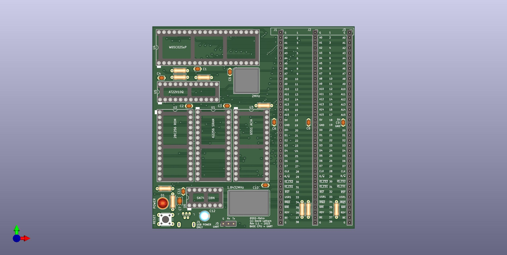

# 6502-Retro!

Inspired by the Z80-Retro! see: [https://github.com/z80-retro](https://github.com/z80-retro)
I decided to see if I could put together a small 6502 based project with a similar
design philosphy.  The main goals of the project are:

1. The base board must be no larger than 100mm x 100mm to leverage the cheaper
    manufacturing options.
2. The base board must provide all required functionality to be minimially operational.
3. Daughter boards will provide additional peripherals such as Graphics and Audio

## Base Board

You can find the hardware 
[schematic](./hardware/6502-retro/6502-retro.pdf) and gerber files for the base 
board in [hardware/6502-retro](./hardware/6502-retro/).

## Memory Map

The memory map is given by an AT22v10Q PLD which provides ranges in the table below.  These values are also defined in [6502-retro-rom.cfg](./software/6502-retro-rom.cfg)

|Range     |Description |Size   | Decoder Pins| Comments
|---       |---         |---    |---          |---
|0000-00FF |Zero Page   |0x100  |             |
|0100-0200 |Stack       |0x100  |             |
|0200-0FFF |SYSRAM      |0xE00  |             |
|1000-7EFF |RAM         |0x6F00 |             |
|          |            |       |             |
|7F00-7F10 |Reserved    |0x16   |             |
|7F10-7F1F |Reserved    |0x16   | IOCS1 + A4  |
|7F20-7F2F |ACIA        |0x16   | IOCS1 + A5  |
|7F30-7F3F |Reserved    |0x16   |             |
|7F40-7F4F |TMS         |0x16   | IOCS1 + A6  |
|7F50-7F8F |Reserved    |0x64   |             |
|7F90-7F90 |Reserved    |0x16   |             |
|7FA0-7FAF |VIA         |0x16   | IOCS2 + A4  | Use for VIA 65C22S
|7FB0-7FBF |IO5         |0x16   | IOCS2 + A5  | Use for VIA 65C22S
|7FC0-7FCF |Reserved    |0x16   |             |
|7FD0-7FDF |IO6         |0x16   | IOCS2 + A6  | Use for VIA 65C22S
|7FE0-7FEF |Reserved    |0x64   |             |
