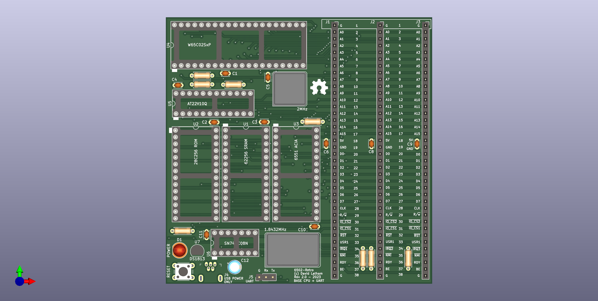
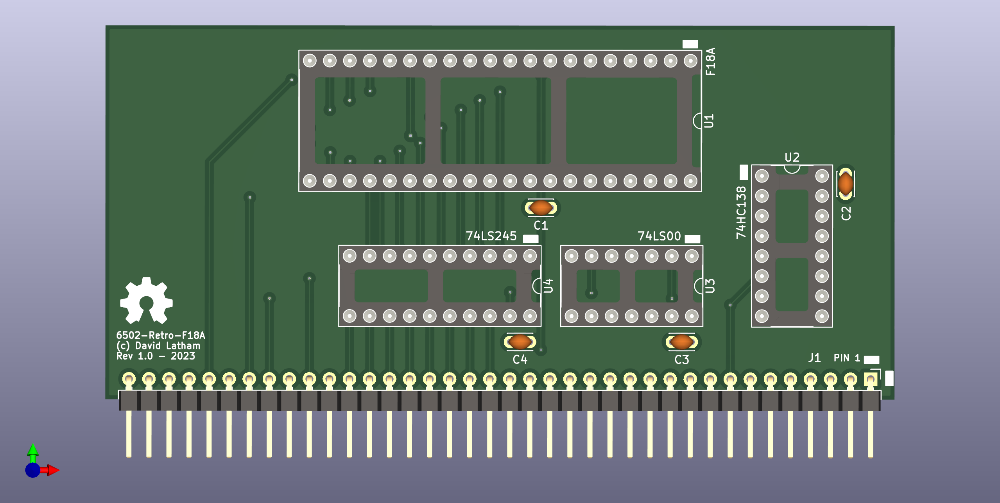
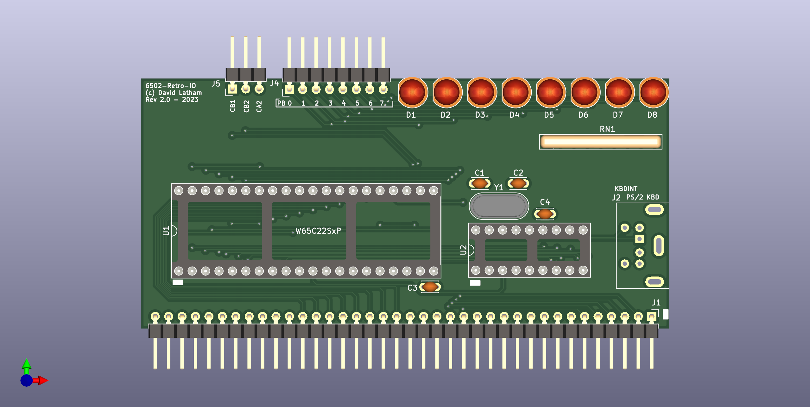

# 6502-Retro!

Inspired by the Z80-Retro! see: [https://github.com/z80-retro](https://github.com/z80-retro)
I decided to see if I could put together a small 6502 based project with a similar
design philosphy.  The main goals of the project are:

1. The base board must be no larger than 100mm x 100mm to leverage the cheaper
    manufacturing options.
2. The base board must provide all required functionality to be minimially operational.
3. Daughter boards will provide additional peripherals such as Graphics and Audio

## Base Board

You can find the hardware 
[schematic](./hardware/6502-retro/6502-retro.pdf) and gerber files for the base 
board in [hardware/6502-retro](./hardware/6502-retro/).

## Expansion Boards

This project contains two expansion boards.

### NOTE !!

One of the expansion slots (J1) is too close to the BAUD RATE Oscilator on the 
base board.  It can be used for manual jumper wires maybe, but I would not risk
putting a card in there as the solder joints on the back of the card will short
against the metal oscilator can for the baud rate clock.

### F18A (TMS9918A FPGA)

The F18A from [dnotq](https://dnotq.io/f18a/intro.html) is mounted with some
glue logic on an expansion board.  It provides all the same features as the 
TMS9918A VDP along with some additional enhancments that can be accessed in
software.

You can find the hardware [schematic here.](./hardware/6502-retro-f18a/6502-retro-f18a.pdf)

### General Purpose IO + PS/2

You can find the hardware [schematic here.](./hardware/6502-retro-io/6502-retro-io.pdf)

Note: PS/2 Support is designed for the [PERIBOARD-409 P - Mini PS/2 keyboard](https://perixx.com/products/ps2-mini-keyboard)

This board has a "sign-on" routine that's handled in the PIC16F628A
microcontroller.  The code for the MCU is included [here](./pic16f628a/)

The more generic / standard PS/2 Keyboards will require the MCU code to be
altered.

## Memory Map

The memory map is given by an AT22v10Q PLD which provides ranges in the table below.  These values are also defined in [6502-retro-rom.cfg](./software/6502-retro-rom.cfg)

|Range     |Description     |Size   | Decoder Pins| Comments
|---       |---             |---    |---          |---
|0000-00FF |Zero Page       |0x100  |             |
|0100-0200 |Stack           |0x100  |             |
|0200-0FFF |SYSRAM          |0xE00  |             |
|1000-7EFF |RAM             |0x6F00 |             |
|          |                |       |             |
|7F00-7F10 |UNMAPPED        |0x16   |             |
|7F10-7F1F |FREE            |0x16   | IOCS1 + A4  | IOCS1 is clock qualified
|7F20-7F2F |ACIA            |0x16   | IOCS1 + A5  |
|7F30-7F3F |UNMAPPED        |0x16   |             |
|7F40-7F4F |F18A / TMS9918A |0x16   | IOCS1 + A6  |
|7F50-7F8F |UNAMPPED        |0x64   |             |
|7F90-7F90 |VIA             |0x16   | IOCS2 + A4  | IOCS2 is not clock qualified
|7FA0-7FAF |FREE            |0x16   | IOCS2 + A5  |
|7FB0-7FBF |UMAPPED         |0x16   |             | 
|7FC0-7FCF |FREE            |0x16   | IOCS2 + A6  |
|7FD0-7FEF |UNMAPPED        |0x64   |             |

* IOCS1 is only active when phi2 is HIGH in the shown address ranges.
* IOCS2 is active in the shown address ranges without any influence by phi2.

See the [PLD Code](./pld/6502-RETRO-PLD.PLD) for the WinCUPL design file.

